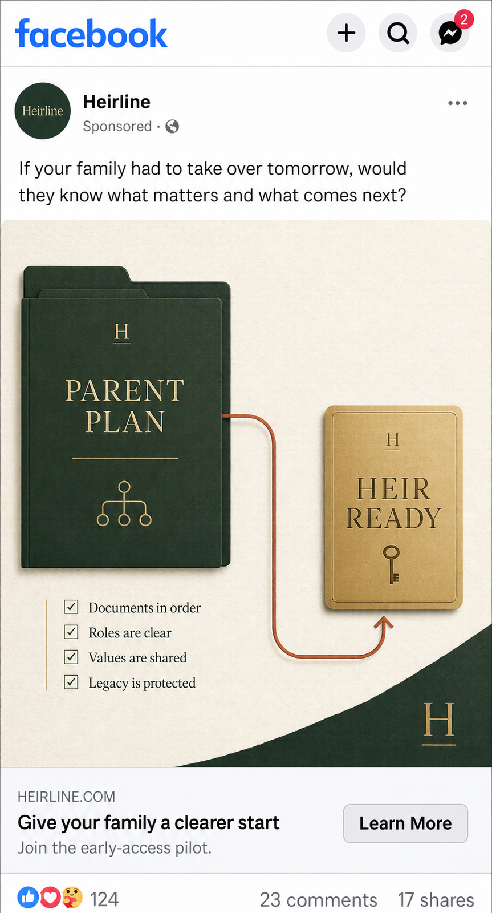
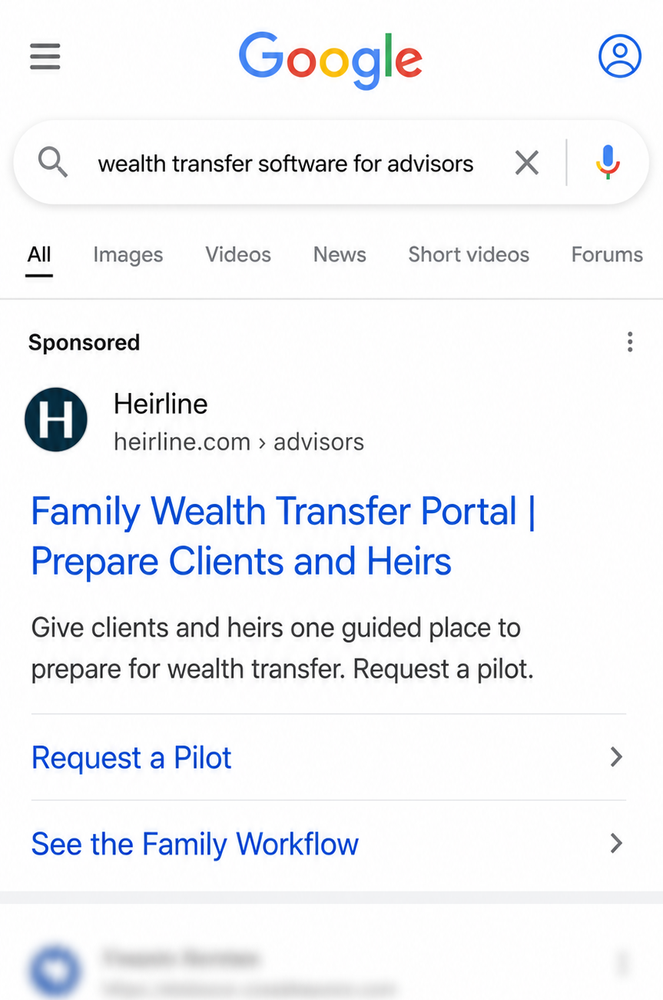
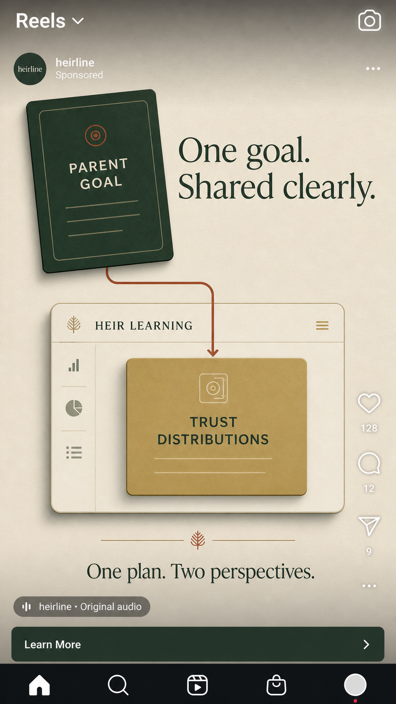

# Heirline Market-Validation Pilot

## Decision this pilot should answer

Heirline should not begin by trying to prove that it can serve every family and every wealth-management firm. A 14-day pilot should answer one narrower question:

**Which entry point creates stronger early demand: families preparing for inheritance conversations, or wealth advisors seeking a better client experience?**

The recommended starting hypothesis is **B2B2C first**: wealth-management firms are the primary buyer, while families and heirs are the users. This matches the product's connected parent, heir, and future advisor experiences and gives Heirline a clearer path to trust, distribution, and professional oversight. The family campaign remains in the pilot as a comparison, not as a second full business model.

## What the market evidence changes

This plan is based on current transfer, channel, and creative evidence rather than an assumption that Heirline should advertise everywhere.

- **The category is large, but the immediate commercial opportunity is specific.** Cerulli estimates that $124 trillion will transfer through 2048 and identifies Generation X as the largest inheriting cohort over the next decade. This makes the advisor-client-heir relationship a more defensible starting point than a broad consumer wealth app.
- **Trusted distribution can move estate planning from awareness to action.** Trust & Will reports that its Fifth Third Bank partnership produced more than 26,000 will redemptions in four months and a 69.3% registration-to-completion rate. Heirline should therefore test whether an advisor or firm can act as the trusted entry point.
- **The strongest creative makes the subject human.** Marketing Architects reports that Trust & Will's intimate, everyday family campaign increased unaided awareness by 75% and purchase intent by 86%. An EmberTribe case study reports that family-oriented micro-influencer ads became Trust & Will's five most profitable Facebook ads, with one ad generating $32,417 in sales over 12 months.
- **Channel fit matters more than novelty.** Pew's 2025 data shows Facebook is used by 74% of U.S. adults ages 50–64 and 57% of adults 65+, while YouTube reaches 85% and 64% of those groups. Reddit reaches 16% and 6%, and TikTok reaches 30% and 12%, respectively. High-intent Search, Facebook Feed, and Meta Reels are therefore the three first paid placements. The same vertical video can be repurposed to YouTube Shorts organically before a separate paid YouTube test.

The resulting creative principle is simple: **make the family handoff human without relying on generic stock photography, name one concrete next step, and make the call to action low pressure.** The finished system uses premium editorial graphics, real product proof, and a human voice. It does not lead with AI, technical architecture, fear, or wealth imagery.

## Audiences and conversion paths

### 1. Wealth advisors and firms — primary

- Target: independent RIAs, estate-planning practices, family-office professionals, and advisor teams serving clients with intergenerational planning needs.
- Promise: give families a guided, client-friendly way to prepare before the next advisor conversation.
- Call to action: **Request a guided pilot.**
- Qualification fields: work email, organization, role, primary need, and consent to follow up.

### 2. Families preparing for a handoff — learning audience

- Target: adults researching estate organization, inheritance conversations, beneficiary readiness, or how to prepare heirs.
- Promise: turn an overwhelming family handoff into a clear plan and a better conversation.
- Call to action: **Join early access.**
- The campaign should not target or imply knowledge of an individual's wealth, age, health, or private financial circumstances.

## 14-day test design

### Week 0 — compliance and measurement preflight

- Confirm the legal advertiser, physical business address, privacy policy, terms, contact information, and any required financial-services disclosures.
- Keep all claims educational and organizational. Do not claim that Heirline provides legal, tax, investment, or fiduciary advice.
- Separate illustrative rows from real campaign rows in the validation sheet.
- Align the dashboard formulas with the live event names used by the website.
- Test every UTM-tagged landing path, form submission, consent record, and thank-you state.

### Days 0–2 — production and preflight

- Produce the 15-second motion-design Reel from the approved frame, product recordings, human voiceover, and commercially cleared music.
- Confirm every UTM-tagged destination, consent record, disclosure, and thank-you state.
- Set campaign-total or lifetime budgets so the entire test remains below the approved cap.

### Days 3–9 — run all three creatives

- Launch the advisor Google Search ad, family Facebook Feed ad, and Meta Reels video together.
- Let all three run for seven days at the approved caps.
- Perform a health check on Day 6. Change only broken tracking, rejected ads, or clearly irrelevant targeting.
- Do not reallocate money between creatives during this first comparison.

### Days 10–14 — follow up and decide

- Conduct short discovery calls with qualified advisor leads.
- Tag each lead as qualified, unqualified, contacted, call booked, or pilot candidate.
- Compare qualified demand, form completion, repeated needs, and cost by audience and creative.
- Write the decision memo before requesting any additional spend.

At the end of Day 14, ask the strongest advisor leads to review the product and discuss a small guided pilot. Send one consented follow-up to family leads asking which workflow they would most value. Then write a decision memo: continue B2B2C, test direct-to-family further, revise the offer, or stop paid acquisition.

## Recommended test budget

This is a controlled validation budget, not a growth budget.

| Item | Allocation | Purpose |
| --- | ---: | --- |
| Google Search | $130 | Seven-day advisor-intent test using a campaign-total budget |
| Facebook Feed | $65 | Seven-day family-readiness test using a lifetime budget |
| Meta Reels | $65 | Seven-day motion-video test using a lifetime budget |
| AI video production | $20 | One month of Runway Standard at the current $15 monthly rate, plus applicable tax |
| Tax and contingency reserve | $20 | Absorb platform tax or measurement fixes; reduce media if needed so the cap is never exceeded |
| **Maximum authorized pilot** | **$300** | Hard cap |

The $300 is an authorization ceiling, not a prediction of impressions, clicks, or leads. All three placements receive one seven-day run so the campaign can compare the finished creatives honestly. The $20 reserve is not automatically spent. If platform tax or a measurement fix would push the test over $300, the media allocation is reduced instead. Paid LinkedIn, Reddit, TikTok, and YouTube are deferred because this budget is too small to test them credibly.

No platform should receive payment information until the compliance preflight is complete. Vantage AI should own the ad accounts and payment method. The project team supplies the finished files, copy, targeting settings, UTM links, and QA checklist. Google should use a campaign-total budget; Meta should use seven-day lifetime budgets. Those controls turn the figures above into hard campaign caps even though auction prices will vary.

No second round is automatic. If the pilot reaches a decision threshold, Phase 2 can request a separate authorization of up to $150 for the single winning audience-and-creative combination.

## Creative concepts

### Creative 01 — Facebook Feed family ad

**Primary text:** If your family had to take over tomorrow, would they know what matters and what comes next? Heirline turns the handoff into one clear, guided plan.

**Headline:** Give your family a clearer start

**Description:** Join the early-access research pilot.

**CTA:** Learn More

**Destination:** `/families?utm_source=meta&utm_medium=paid_social&utm_campaign=family_readiness&utm_content=clearer_start`

The central artwork is intentionally non-photographic: a premium editorial handoff from a dark-green **Parent Plan** folder to a gold **Heir Ready** card. This avoids uncanny generated people and makes the concept recognizable even before the copy is read.

### Creative 02 — Google responsive Search ad for advisor intent

All assets stay within Google's published limits of 30 characters per headline and 90 characters per description.

**Headline 1 (29):** Family Wealth Transfer Portal

**Headline 2 (25):** Prepare Clients and Heirs

**Headline 3 (24):** Request a Heirline Pilot

**Description 1 (88):** Give clients and heirs one guided place to prepare for wealth transfer. Request a pilot.

**Description 2 (80):** Turn family intentions into clear next steps while keeping advisors in the loop.

**Path:** `heirline.com/advisors`

**Initial keyword themes:** family wealth transfer software; inheritance planning portal; engage next generation clients; wealth transfer client experience.

### Creative 03 — Meta Reels motion-design video

This is a real 15-second video placement, not a photo carousel. It uses AI-assisted animation without using AI-generated people.

1. **0–3 seconds — designed opening:** The dark-green **Parent Goal** card enters as the rust connector draws itself. On-screen copy: “One goal. Shared clearly.”
2. **3–7 seconds — real product proof:** A screen recording shows the parent assigning **Trust distributions** to Maya.
3. **7–11 seconds — real handoff:** A screen recording shows the exact goal appearing inside Maya's heir dashboard.
4. **11–15 seconds — designed close:** The gold **Trust distributions** card settles into the **Heir Learning** frame. End card: “One plan. Two perspectives. Join early access.”

**Human voiceover, approximately 15 seconds:**

> What if one clear goal could prepare the next generation? Heirline lets a parent share what matters, then turns it into a clear learning step for the heir. One plan. Two perspectives. Join early access.

The preferred voice is a real team member or another approved adult speaker. Record it cleanly in a quiet room, then edit out breaths and normalize the volume. AI voice is only a fallback if the specific voice and commercial license are approved. Music should be low, warm, lyric-free, and commercially cleared; captions remain on throughout.

**Runway image-to-video prompt:**

> Animate this exact vertical 9:16 editorial Heirline frame while preserving every word, logo, color, and object. The dark forest-green Parent Goal card glides in from the upper left with a subtle dimensional lift. A restrained rust connector line traces smoothly toward the cream Heir Learning frame. The muted-gold Trust Distributions card settles into place with a soft, confident ease. Add a very slow camera push, refined paper texture, and premium editorial motion. No people, no new text, no extra objects, no morphing, no warped typography, no flashy effects. Four seconds, seamless, sophisticated, calm, brand-safe.

Runway supplies the animated graphic moments. The Heirline screen recordings remain real. Edit the final sequence in a standard video editor, add the voiceover and licensed music, export at 1080×1920, and keep the main copy inside Reels safe zones. The same 9:16 master can be posted to Instagram Reels, Facebook Reels, and YouTube Shorts; a later 16:9 cut can serve YouTube pre-roll.

## Measurement

### Funnel

1. Landing-page view
2. Early-access or pilot form opened
3. Form submitted with consent
4. Qualified lead
5. Discovery call booked
6. Pilot candidate

### Primary metrics

- Cost per qualified advisor lead
- Advisor landing-to-lead conversion rate
- Number of discovery calls booked
- Number of firms willing to discuss a guided pilot
- Family landing-to-lead conversion rate
- Conversion rate by source, campaign, audience, and creative

### Pilot decision thresholds

The pilot is promising if it produces either:

- at least **3 qualified advisor leads** and at least **1 completed discovery call**; or
- at least **10 consented family leads**, with a clear repeated problem visible in the selected priorities and follow-up responses.

These thresholds are directional because a $300 campaign is a small-sample validation test. They are not proof of product-market fit.

## Data and privacy boundary

- The existing website event adapter and validation sheet are appropriate for a controlled demonstration and early pilot measurement.
- Before paid traffic begins, create separate `Sample` and `Live` views or tabs and make the dashboard read only from `Live`.
- Restrict the sheet to the smallest authorized team.
- Collect only contact and campaign-validation fields. Do not collect account balances, legal documents, government identifiers, health information, or investment details.
- Define a retention period and delete unqualified lead data when it is no longer needed.
- A production launch would require professional legal, privacy, cybersecurity, and financial-services compliance review.

## Ownership after the internship

A funded campaign extends beyond the final presentation. It should proceed only if Vantage AI names:

- an adult budget owner and advertising-account owner;
- a person responsible for privacy and compliance review;
- a person responsible for responding to leads;
- a team member responsible for weekly reporting; and
- a clear agreement covering whether and how the internship team remains involved.

The final internship deliverable can therefore be a **launch-ready pilot proposal**. Running the campaign and analyzing real customer data would be a separate, explicitly approved next phase with Vantage AI.

## Sources and platform constraints

- Cerulli, $124 trillion wealth transfer through 2048: https://www.cerulli.com/press-releases/cerulli-anticipates-124-trillion-in-wealth-will-transfer-through-2048
- Cerulli, Generation X as the immediate opportunity: https://www.cerulli.com/press-releases/generation-x-represents-the-most-immediate-opportunity-for-wealth-managers
- Pew Research Center, 2025 platform use by age: https://www.pewresearch.org/internet/fact-sheet/social-media/
- Trust & Will and Fifth Third Bank case study: https://trustandwill.com/learn/fifth-third-bank-case-study
- Marketing Architects, Trust & Will TV creative case study: https://www.marketingarchitects.com/case-studies/tv-spots/trust-%26-will
- EmberTribe, Trust & Will micro-influencer ad case study: https://www.embertribe.com/case-studies/changing-estate-planning-with-micro-influencers
- Meta lead generation overview: https://www.facebook.com/business/ads/ad-objectives/lead-generation
- Meta Reels guidance: https://www.facebook.com/business/ads/facebook-instagram-reels-ads
- Google responsive Search ad limits: https://support.google.com/google-ads/answer/7684791
- Google Ads campaign-total budgets: https://support.google.com/google-ads/answer/10487143
- Google financial-products and services policy: https://support.google.com/adspolicy/answer/2464998
- Google financial-services disclosure requirements: https://support.google.com/adspolicy/answer/15187149
- Runway pricing: https://runway.com/pricing
- Runway terms for commercial use of outputs: https://runway.com/terms-of-use
