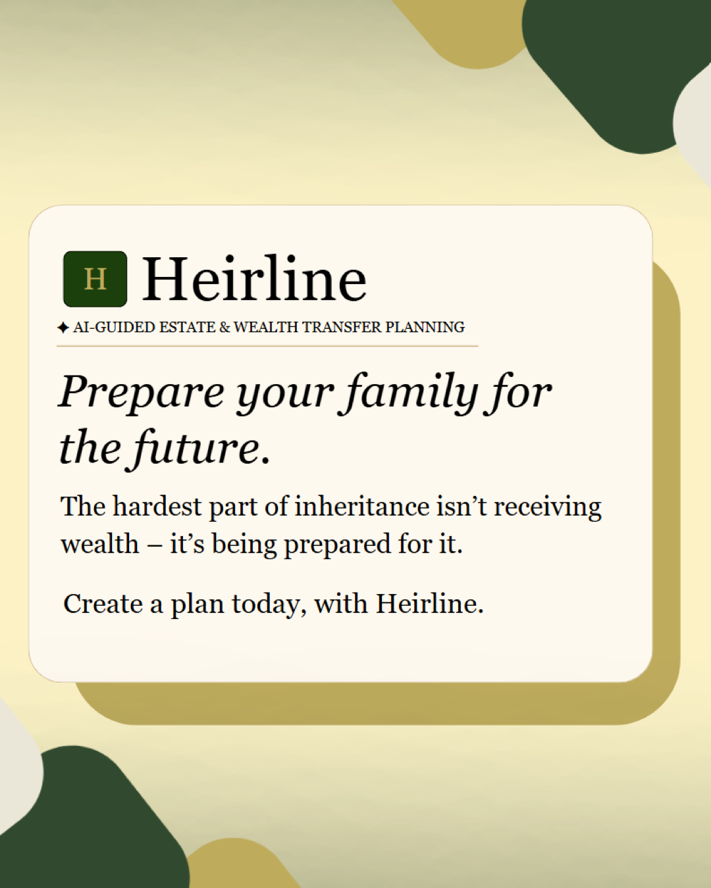

# Heirline $200 Market-Validation Pilot

Updated: August 2, 2026

## Executive recommendation

Use the first Vantage AI-funded test to answer one focused question: **will a
clear family-financial-handoff message produce enough qualified interest to
justify a larger pilot?**

Heirline's longer-term model is **B2B2C**: a wealth-management firm or advisor is
the likely buyer or distribution partner, while parents and heirs are the users.
The first paid campaign should nevertheless target families only. A $200 ceiling
is too small to divide credibly between two platforms and two buying audiences.
During the same period, validate advisor demand through direct, no-cost outreach
to 10 independent firms.

This is a learning budget, not a promise of conversions. The plan uses three
evidence-informed ads, first-party form tracking, hard spend caps, and written
decision rules. Actual performance cannot be known until the test runs.

## What Heirline is advertising

Heirline is a guided family wealth-planning workspace. It helps a parent:

- organize wills, trusts, beneficiaries, responsibilities, and open questions;
- share only approved context with an heir;
- turn that context into clear learning steps for the next generation; and
- keep qualified legal and financial professionals involved.

The ads should make that financial purpose unmistakable. They should not lead
with AI, imply that Heirline replaces an advisor or attorney, promise financial
outcomes, or suggest knowledge of a viewer's private finances.

## Why Meta and Reddit

- Meta provides the stronger paid reach for the family audience. Pew Research
  Center's 2025 survey reports Facebook use among 74% of U.S. adults ages 50–64
  and 57% of adults 65 and older.
- Reddit is a smaller older-adult channel, but its interest, keyword, community,
  and conversation context can surface people already discussing retirement,
  inheritance, caregiving, and estate organization.
- Meta recommends creative diversification and mobile-ready placements. Reddit's
  analysis of nearly 150,000 ads emphasizes clear branding, conversational copy,
  mobile design, and using text deliberately.
- Trust & Will case studies suggest that estate-planning marketing performs best
  when it makes the subject human and gives people a concrete next step. Those
  results are directional examples, not benchmarks for Heirline.

## Audience and conversion

### Paid audience: families preparing for a financial handoff

- Geography: United States
- Message: documents alone do not prepare a family; Heirline connects the plan,
  the people, and the next steps.
- CTA: **Learn More**
- Conversion: a valid, consented early-access form submission.
- Data boundary: collect contact and research fields only. Never request account
  balances, legal documents, tax IDs, government identifiers, passwords, or
  investment details.

### No-cost audience: wealth advisors and firms

Contact 10 independent RIAs or wealth-management firms directly. Ask whether
they would review a guided family-handoff prototype, what would need to be
customizable, and whether they would consider a small client pilot. This tests
the buyer hypothesis without diluting paid-media learning.

## Exact $200 ceiling

The domain is part of the same $200 An approved.

| Use | Maximum | Spending control |
| --- | ---: | --- |
| First year of approved `.com` domain | $12 | Buy through a Vantage-owned registrar account only; exact checkout controls |
| Meta | $100 | One campaign, one ad set, two static ads, seven-day lifetime budget |
| Reddit | $70 | $10 daily budget for seven days with a fixed end date |
| Reserve | $18 | Domain checkout variation, tax, or required tracking repair; otherwise unspent |
| **Absolute maximum** | **$200** | No automatic second round or additional purchase |

Porkbun currently publishes `.com` registration from $11.08. The $12 line is a
cap for planning, not a guaranteed invoice. If the domain costs more, use the
reserve first; if the total would exceed $200, reduce Meta spend. The reserve is
not automatically converted into ad spend.

## Domain recommendation

Live registry checks on August 2 found the following:

- Registered: `heirline.com`, `heirline.org`, `getheirline.com`,
  `heirlineapp.com`, and `myheirline.com`.
- No registry record returned: `tryheirline.com`, `joinheirline.com`,
  `heirlinewealth.com`, `heirlinefamily.com`, and `heirlineplanning.com`.

**Recommended pilot choice:** `tryheirline.com`.

**Fallback order:** `joinheirline.com`, then `heirlinewealth.com`.

Availability and price must be rechecked in the Vantage-owned registrar account
at checkout. A domain lookup is not trademark or brand clearance. Preliminary
research also found an estate-planning firm using the Heirline name and another
inheritance-related product using a similar name. An should approve whether to
use Heirline for the pilot and obtain appropriate brand clearance before a
scaled public launch. Do not buy the resale listing for `heirline.com` without a
separate written price approval.

## Three finished creatives

### Meta A — Parent Plan / Heir Ready

**Primary text**

> Estate documents are only one part of a family financial handoff. Heirline
> helps parents organize wills, trusts, beneficiaries, and responsibilities,
> share approved context with heirs, and keep the right professionals involved.

**Headline:** Give the next generation a clearer financial start

**Description:** Join the Heirline early-access research pilot.

**CTA:** Learn More

**Upload asset:** `marketing-assets/heirline-meta-parent-plan-4x5.png`

**Concept owner:** Vedang

**Tracked destination**

```text
https://tryheirline.com/?open=interest&audience=family&utm_source=meta&utm_medium=paid_social&utm_campaign=heirline_family_validation_2026_08&utm_content=parent_plan
```


The separate `heirline-facebook-feed.png` file is a presentation mockup with
simulated Facebook interface and engagement. It is not the file to upload to
Ads Manager.

### Meta B — Prepared for the Future

**Primary text**

> Receiving an inheritance is not the same as being ready to manage it.
> Heirline connects parents, heirs, and advisors in one guided workspace for
> estate readiness, financial education, and clearer next steps.

**Headline:** Prepare your family before the handoff

**Description:** Explore a connected family wealth-planning experience.

**CTA:** Learn More

**Upload asset:** `marketing-assets/heirline-meta-prepared-future-4x5.png`

**Concept owner:** Aayush

**Tracked destination**

```text
https://tryheirline.com/?open=interest&audience=family&utm_source=meta&utm_medium=paid_social&utm_campaign=heirline_family_validation_2026_08&utm_content=prepared_future
```



### Reddit — Handoff Plan

**Title:** An estate plan organizes documents. Who prepares the family?

**Body**

> We’re building Heirline, a family wealth-planning tool that helps parents
> organize a future financial handoff and helps heirs prepare for investing,
> taxes, trusts, and financial responsibility. If you have dealt with
> inheritance planning, what was the hardest part, and what would make a tool
> like this useful or untrustworthy? Explore the early-access pilot and share
> your honest feedback.

**CTA:** Learn More

**Upload asset:** `marketing-assets/heirline-meta-parent-plan-4x5.png`

**Concept owner:** Jasmine, tightened for paid placement by Vedang

**Tracked destination**

```text
https://tryheirline.com/?open=interest&audience=family&utm_source=reddit&utm_medium=paid_social&utm_campaign=heirline_family_validation_2026_08&utm_content=handoff_plan
```

This preserves Jasmine's discussion-led idea while making the product and
financial use case clear before the question. The final title is under Reddit's
recommended 150-character limit.

## Exact campaign settings

### Meta

- Campaign: `HL_Family_Validation_Aug2026_Meta`
- Objective: Traffic
- Destination: Website
- Performance goal: maximize link clicks until an approved Meta Pixel exists;
  use the Heirline validation sheet as the source of truth for submitted forms.
- Budget: $100 lifetime over seven complete days
- Structure: one ad set, two static 4:5 ads
- Location: United States
- Audience: broad eligible targeting. If Ads Manager does not require the
  Financial Products and Services Special Ad Category, use ages 45–65+ and
  estate planning, retirement planning, wills and trusts, family caregiving,
  and financial planning only as suggestions. If the category is required,
  accept every restriction and do not attempt to work around it.
- Placements: Advantage+ placements, after checking every generated preview
- CTA: Learn More

### Reddit

- Campaign: `HL_Family_Validation_Aug2026_Reddit`
- Objective: Traffic
- Bid strategy: Lowest cost
- Budget: $10 per day for seven days; fixed end date
- Placements: Feed and Conversation
- Location: United States
- Interests to verify: Personal Finance, Retirement, Family and Relationships,
  Financial Planning, and Wealth Management
- Keywords to verify: estate planning, inheritance, beneficiary, family trust,
  wills and trusts, preparing heirs, and financial handoff
- Communities to check for eligibility: `r/personalfinance`,
  `r/EstatePlanning`, `r/retirement`, and `r/financialplanning`
- Comments: enable only if a named adult or team member checks them daily and
  escalates legal, tax, investment, or personal-finance questions.

The live choices shown in each ad platform control. Platform policies, pricing,
and available targeting can change.

## Launch flow

1. An approves the domain, exact allocation, product name for the pilot, legal
   advertiser details, privacy/disclaimer language, and team access.
2. Purchase the approved domain in a Vantage-owned account and connect it to
   GitHub Pages with HTTPS.
3. Verify the three tagged `tryheirline.com` links after deployment.
4. Open each link and confirm it launches the early-access form immediately.
5. Submit one labeled QA record through each link and verify its source,
   campaign, and creative in the live validation sheet.
6. Load both campaigns in a paused state, review all placement previews and
   totals, and send screenshots to An.
7. Launch only after written approval.
8. End automatically after seven days, follow up with consented leads, and
   deliver a decision memo by Day 14.

The full operating checklist is in `PILOT_LAUNCH_CHECKLIST.md`.

## Measurement and decisions

Track spend, impressions, clicks, click-through rate, form opens, valid form
submissions, landing-to-lead conversion, cost per valid lead, follow-up replies,
and repeated user problems by platform and creative.

- **Promising family signal:** at least 10 valid consented leads and at least
  three follow-up responses repeating the same preparation problem.
- **Promising advisor signal:** at least three substantive advisor conversations
  from direct outreach and one willingness to review or pilot the product.
- **Stop immediately:** broken tracking, a rejected or misleading ad, spend-cap
  failure, collection of sensitive data, or a compliance concern.
- **No automatic second round:** ask for additional funding only after the team
  can identify one audience-and-message combination worth testing further.

These are directional thresholds for a small test, not proof of product-market
fit.

## Privacy and product boundary

Use this user-visible position, subject to Vantage AI review:

> Heirline is an educational and organizational prototype. It does not provide
> legal, tax, investment, or financial advice and does not create a fiduciary,
> attorney-client, or advisor-client relationship. Consult qualified
> professionals before acting.

For the form:

> We use your email and responses only to contact you about the pilot and
> analyze interest. Do not submit account balances, legal documents, government
> identifiers, or other sensitive financial data.

The validation sheet should be restricted to authorized people, separate
illustrative and live rows, and retain lead data only as long as Vantage AI
approves. A scaled product requires professional legal, privacy, cybersecurity,
and financial-services compliance review.

## Sources

- Pew Research Center, current social-media use by age: https://www.pewresearch.org/internet/fact-sheet/social-media/
- Meta, lead-generation ads and forms: https://www.facebook.com/business/ads/ad-objectives/lead-generation
- Meta, ad creative and placement guidance: https://www.facebook.com/business/ads/ad-creative
- Meta, prohibited financial products: https://www.facebook.com/policies/ads/prohibited_content/prohibited_financial_products_and_services
- Meta, Special Ad Category overview: https://www.facebook.com/help/messenger-app/621956575422138/
- Reddit, auction pricing and budget controls: https://www.business.reddit.com/learning-hub/articles/reddit-advertising-costs
- Reddit, 2026 research-backed creative guidance: https://www.business.reddit.com/copy-creative-best-practices
- Reddit, campaign formats: https://www.business.reddit.com/learning-hub/articles/what-are-reddit-ads-formats-smbs
- Reddit, Pixel documentation: https://business.reddithelp.com/articles/Knowledge/reddit-pixel
- Porkbun, current domain pricing: https://porkbun.com/products/domains
- Cloudflare Registrar, at-cost registration: https://developers.cloudflare.com/registrar/
- Trust & Will/Fifth Third case study: https://trustandwill.com/learn/fifth-third-bank-case-study
- EmberTribe, Trust & Will Meta creative case study: https://www.embertribe.com/case-studies/changing-estate-planning-with-micro-influencers
